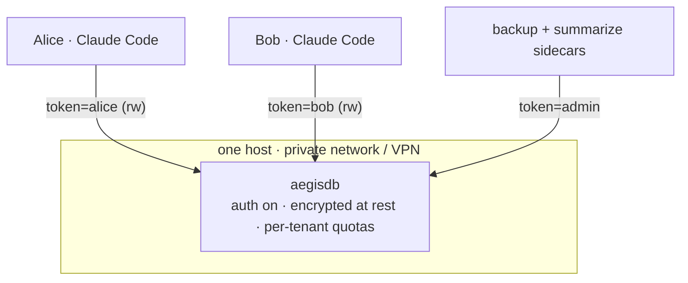
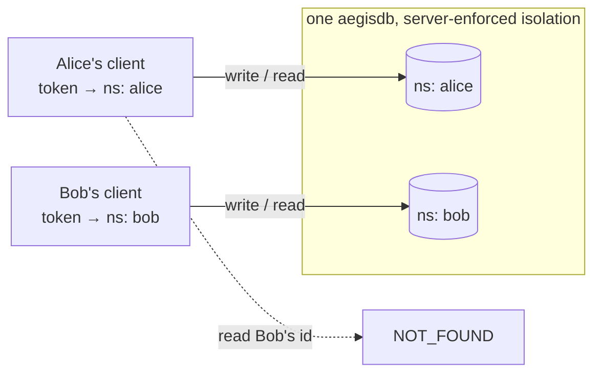

# Tutorial: a shared AegisDB memory server for your team

This is the **one blessed path** for standing up a single AegisDB that a whole
team's Claude Code instances share — with authentication, per-person isolation,
encryption, and backups. It is opinionated on purpose: it uses Docker Compose,
picks sensible defaults, and mentions the many other knobs only where a decision
is genuinely yours. When you want the full option list, each step links to the
reference docs.

By the end you'll have:



Each teammate's memories are isolated by a **namespaced token** — the server
enforces it, so no one can read another tenant's memories even by asking:



---

## Before you start: two decisions

Everything else has a good default. These two you must pick, because **every
client must agree with the server**:

1. **Embedding provider + dimension.** Semantic recall needs embeddings, and the
   vector size must be identical on the server (`--embedding-dim`) and every
   client (`AEGIS_EMBEDDING_DIMENSIONS`).
   - **Recommended — Voyage** (`voyage-3-large`, **1024**): lightweight clients,
     best recall, one API key per client. This tutorial uses **1024** throughout.
   - **No-API-key alternative — local** (`all-MiniLM-L6-v2`, **384**): fully
     offline, but each client downloads a model. If you choose this, substitute
     **384** everywhere you see 1024, and set `AEGIS_EMBEDDING_MODE=local` on
     clients instead of `voyage`.

2. **Isolation model.** This tutorial uses **isolated tenants** (one namespaced
   token per person/project) — the recommended default. A shared collaborative
   pool is a variant noted at the end.

**Prerequisites:** a host with Docker + Docker Compose, reachable by the team
over a private network (VPN/WireGuard, an SSH tunnel, or a TLS-terminating
reverse proxy). AegisDB does **not** terminate TLS itself, and tokens travel in
plaintext — never expose the port to the public internet directly.

---

## Step 1 — Get the server files

```sh
git clone https://github.com/d4n-larsson/aegisdb.git
cd aegisdb
cp .env.example .env
```

You'll edit `.env` (the single place all settings live) as you go. The
`docker-compose.yml` already wires those values into the server's flags.

---

## Step 2 — Mint tokens

Authentication is off until you configure a token file. Generate an **admin**
token (for operations/`stats`/runtime token management) and one **namespaced**
token per teammate. Each command prints two lines: the first goes into the token
file (the server stores only a hash); the second is the plaintext, shown once —
hand it to that person and don't store it server-side.

```sh
# build the binary once, just to run the token tool (or use any release binary)
make

# admin token — keep this one safe; it can see every tenant
./build/aegisdb gen-token --scope admin

# one per teammate / project
./build/aegisdb gen-token --namespace alice --scope rw
./build/aegisdb gen-token --namespace bob   --scope rw
./build/aegisdb gen-token --namespace ci    --scope ro   # read-only example
```

Collect the **first** line of each into `./tokens.txt`:

```
sha256$<admin-hash>
sha256$<alice-hash> alice rw
sha256$<bob-hash>   bob   rw
sha256$<ci-hash>    ci    ro
```

> Format: `<token> [namespace] [scope]`. A line with no namespace is a global
> admin token; `rw`/`ro` set read-write vs read-only. Tokens are stored hashed
> (`sha256$…`), so a leaked file reveals nothing usable. Use high-entropy tokens
> (`gen-token` does this for you). Full model:
> [README § Authentication & multi-tenancy](../README.md#authentication--multi-tenancy).

---

## Step 3 — (Recommended) Encryption at rest

So a stolen disk, volume snapshot, or backup tarball reveals nothing:

```sh
./build/aegisdb gen-key > key.hex     # 32-byte key; store it 0600, OFF the data volume
chmod 600 key.hex
```

You'll mount both files and point the server at them in the next step. Keep
`key.hex` backed up separately — **without it the data is unrecoverable.** Details
and the plaintext→encrypted migration path:
[README § Encryption at rest](../README.md#encryption-at-rest).

---

## Step 4 — Configure `.env`

Set these in `.env` (leave everything else at its default):

```sh
# Reachability. Bind to loopback and reach it over your VPN/tunnel/proxy;
# set AEGIS_BIND=0.0.0.0 ONLY if the host itself is on a trusted private network.
AEGIS_BIND=127.0.0.1
AEGIS_HOST_PORT=9470
AEGIS_PORT=9470

# Must equal every client's AEGIS_EMBEDDING_DIMENSIONS (see "two decisions").
AEGIS_EMBEDDING_DIM=1024

# Auth + encryption + per-tenant quotas, passed straight to the server.
AEGIS_EXTRA_ARGS=--auth-token-file /data/tokens.txt --encryption-key-file /data/key.hex

# Guard rails so one runaway agent can't fill the disk or hog the server.
AEGIS_TENANT_MAX_RECORDS=200000
AEGIS_TENANT_MAX_BYTES=1073741824      # 1 GiB per tenant
AEGIS_TENANT_RATE_QPS=50

# Admin token used by the backup/summarize sidecars (Step 7).
AEGIS_AUTH_TOKEN=<admin plaintext from Step 2>
```

Then make `tokens.txt` and `key.hex` visible inside the container by adding them
to the `aegisdb` service's `volumes:` in `docker-compose.yml`:

```yaml
    volumes:
      - aegis-data:/data
      - ./tokens.txt:/data/tokens.txt:ro
      - ./key.hex:/data/key.hex:ro
```

---

## Step 5 — Start it

```sh
docker compose up -d --build
docker compose logs -f aegisdb      # watch it come up; Ctrl-C to stop tailing
```

Confirm it's alive and enforcing auth (`ping` is the only unauthenticated op):

```sh
# ping needs no token
docker compose exec aegisdb aegisdb client --port 9470 ping

# any other op with no token is rejected
docker compose exec aegisdb aegisdb client --port 9470 search --top-k 1   # -> UNAUTHORIZED
```

> `docker compose up` reuses a cached image and won't pick up code changes on its
> own — always pass `--build` after pulling a new version.

---

## Step 6 — Connect a teammate's Claude Code

The integration is the published `aegisdb-mcp` package (run with `uvx`, no
clone). In that person's project, create `.mcp.json`:

```jsonc
{
  "mcpServers": {
    "memory": {
      "command": "uvx",
      "args": ["aegisdb-mcp"],
      "env": {
        "AEGIS_HOST": "memory.internal",          // the server's private address
        "AEGIS_PORT": "9470",
        "AEGIS_AUTH_TOKEN": "<alice's plaintext token>",
        "AEGIS_EMBEDDING_MODE": "voyage",
        "AEGIS_EMBEDDING_DIMENSIONS": "1024",
        "VOYAGE_API_KEY": "<alice's Voyage key>"
      }
    }
  }
}
```

The token's namespace is authoritative, so you **don't** set `AEGIS_NAMESPACE` —
the server pins every write and filters every read to `alice`. Then enable
automatic recall + capture by adding the two hooks to `.claude/settings.json`:

```jsonc
{
  "hooks": {
    "UserPromptSubmit": [
      { "hooks": [ { "type": "command", "command": "uvx --from aegisdb-mcp aegisdb-recall-hook" } ] }
    ],
    "SessionEnd": [
      { "hooks": [ { "type": "command", "command": "uvx --from aegisdb-mcp aegisdb-capture-hook" } ] }
    ]
  }
}
```

Full client walkthrough (embedding modes, hook tuning, token budgets):
[integration README](../integrations/claude-code/README.md).

---

## Step 7 — Verify isolation and operate

**Isolation holds** — Alice cannot see Bob's memories even by asking:

```sh
# as Alice: write, then read back — OK
docker compose exec aegisdb aegisdb client --port 9470 --token <alice> \
  put --type episodic --tags note "alice's note"
# as Bob: search returns nothing of Alice's; a get of her id -> NOT_FOUND
```

**See per-tenant usage** (admin only):

```sh
docker compose exec aegisdb aegisdb client --port 9470 --token <admin> stats
```

**Add or revoke a teammate at runtime** — no restart; the change persists back to
`tokens.txt`:

```sh
./build/aegisdb gen-token --namespace carol --scope rw       # mint
# admin token_add with the hashed line, or token_list / token_revoke by fingerprint
```

See the `token_list` / `token_add` / `token_revoke` ops in
[docs/wire-protocol.md](wire-protocol.md).

**Turn on backups** (off-box snapshots on a schedule):

```sh
docker compose --profile backup up -d
```

**Turn on background summarization** (distil each tenant's aging memories to keep
recall cheap). Set the backend in `.env` (`AEGIS_SUMMARY_MODE=anthropic` +
`ANTHROPIC_API_KEY`, and `AEGIS_SUMMARY_NAMESPACE` per tenant), then:

```sh
docker compose --profile summarize up -d --build
```

Both are documented in [README § Backups](../README.md#backups--disaster-recovery)
and the [integration README § Background summarization](../integrations/claude-code/README.md).

---

## Troubleshooting

| Symptom | Cause & fix |
|---|---|
| Client logs `embedding dimension mismatch … disabling embeddings` | `AEGIS_EMBEDDING_DIMENSIONS` ≠ the server's `--embedding-dim`. Make them equal (1024 for Voyage, 384 for local). |
| Every request returns `UNAUTHORIZED` | Missing/wrong token, or the token file isn't mounted. Check `./tokens.txt` is in the service `volumes:` and the client's `AEGIS_AUTH_TOKEN` matches a plaintext you issued. |
| Writes return `FORBIDDEN` | The token is `ro`. Issue an `rw` token for that tenant. |
| Writes return `QUOTA_EXCEEDED` / requests `RATE_LIMITED` | The tenant hit `AEGIS_TENANT_MAX_*` / `AEGIS_TENANT_RATE_QPS`. Raise the limit or clean up. |
| Server won't start after enabling encryption | Wrong/missing key for the data dir (fail-closed). Use the exact `key.hex`; convert an existing plaintext dir with `--encrypt-migrate`. |
| Code changes don't take effect | `docker compose up` reused the cached image — run `docker compose up -d --build`. |

---

## Variant: one shared pool instead of isolated tenants

To have several people share **one** common memory pool (not isolated), give them
tokens in the **same** namespace (or global admin tokens) and set the **same**
`AEGIS_NAMESPACE` on every client — that shared namespace is what joins the pool.
Everything else in this tutorial is identical.

## Where to next

- Full flag reference: [README § Configuration flags](../README.md#configuration-flags)
- Wire protocol: [docs/wire-protocol.md](wire-protocol.md)
- Local single-user setup: [docs/quickstart.md](quickstart.md)
- Read replicas for HA / read scaling: [docs/read-replica-design.md](read-replica-design.md)