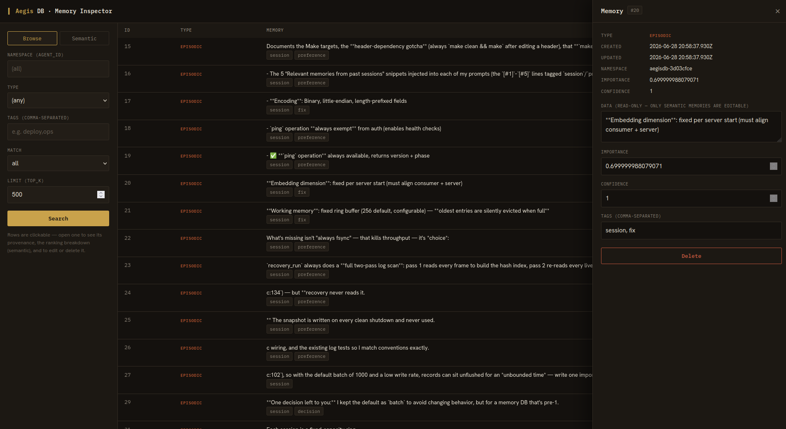

# Memory Inspector

A local, browser-based lens on what an AegisDB instance remembers (ROADMAP
Horizon 1.3). Browse and search memories, see each hit's **provenance** and — for
semantic queries — the **ranking breakdown** (why it surfaced: similarity ×
weight × recency, from `search`'s `explain`), and correct a wrong memory by
editing or deleting it.



The inspector wears the shared **AegisDB visual identity** — the ink/brass/paper
ledger palette, the memory-type colours, and the type system used by the landing
site. The tokens are **inlined** so the page renders correctly however it's
opened (through the bridge, from the filesystem, or an IDE preview); a drift guard
in `test_bridge.py` keeps them matching the canonical source, `site/aegis.css`.

## Run

The inspector is an HTTP→TCP **bridge** that a browser talks to (a web page can't
speak the raw wire protocol). It needs a **running** aegisdb.

**With Docker Compose** — the inspector is its own opt-in profile:

```sh
docker compose --profile inspector up -d --build
```

Then open <http://127.0.0.1:8600/>. (A plain `docker compose up` starts only the
server; the inspector is opt-in, like `metrics`/`monitoring`.)

**Without Docker** — start your server, then run the bridge on the host:

```sh
make inspector INSPECTOR_ARGS='--aegis-port 9470'
# or directly:
python3 tools/inspector/bridge.py --aegis-port 9470
```

Open the URL the bridge prints — <http://127.0.0.1:8600/>. Don't open
`index.html` as a file: it needs the bridge for the database API (it'll say so if
you do).

With auth enabled, pass the token (kept server-side, never sent to the browser):

```sh
make inspector INSPECTOR_ARGS='--aegis-port 9470 --token <tok> --embedding-dim 384'
```

## Why a bridge?

Browsers can't speak AegisDB's newline-delimited-JSON-over-TCP wire protocol, so
`bridge.py` (stdlib only) does three small things:

1. serves the self-contained `index.html` UI,
2. proxies an **allow-listed** set of operations to the DB (`ping`, `stats`,
   `search`, `get`, `count`, `update`, `delete`) — it's a lens, not a control
   plane, so token admin / snapshots / bulk writes are refused,
3. embeds query text server-side so semantic search + `explain` work without
   shipping an embedder to the browser.

It binds to `127.0.0.1` and injects the auth token itself. **Do not expose it to
a network** — it hands out an authenticated proxy to your database.

## Embeddings

The server does not compute embeddings — clients supply them — so semantic search
needs an embedder, and it **must match the one that produced the stored vectors**
or similarities are meaningless. Options (`--embedder`):

- `subword` (default) — deterministic char-trigram hashing; forgiving of
  morphology, good for demo/eval databases with no external model.
- `hashing` — exact-unigram hashing (matches the eval harness baseline).
- `command --embedder-cmd '<prog>'` — shell out to your real model (reads text on
  stdin, prints a JSON array of `--embedding-dim` floats). Use this against a
  production corpus embedded by a real model.
- `none` — disable semantic search; **browse, provenance, edit, and delete still
  work** and need no embedder.

## Test

```sh
make inspector-test   # spawns a server + bridge, exercises every UI endpoint
```